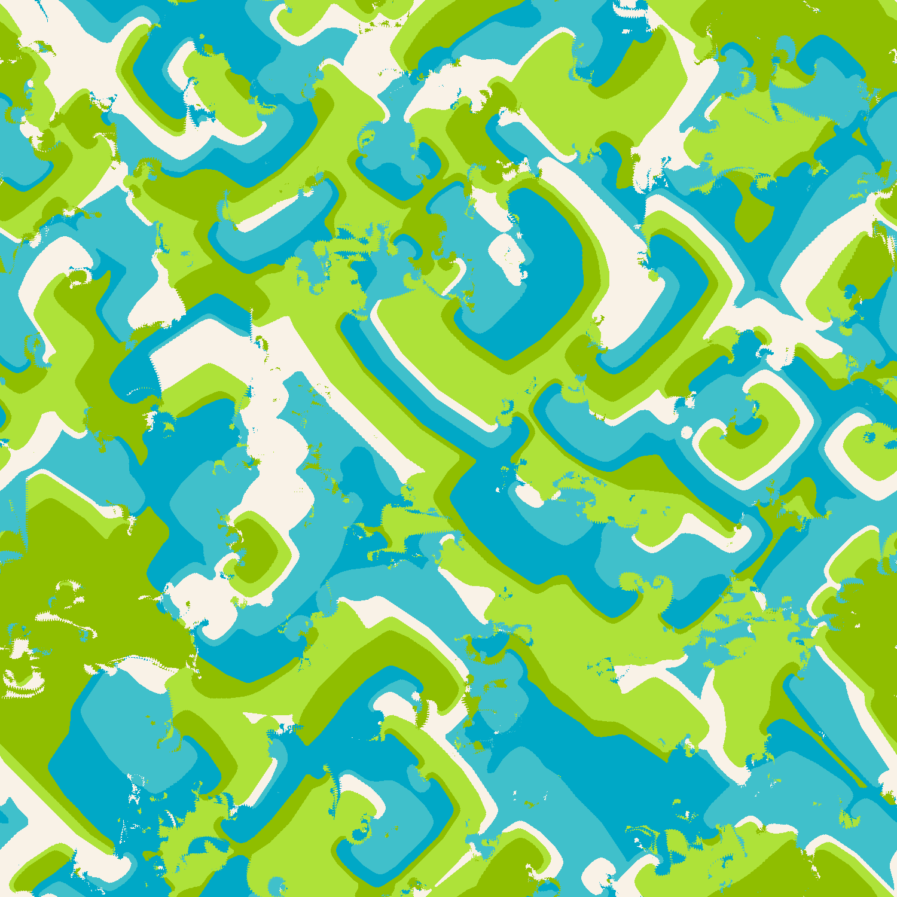
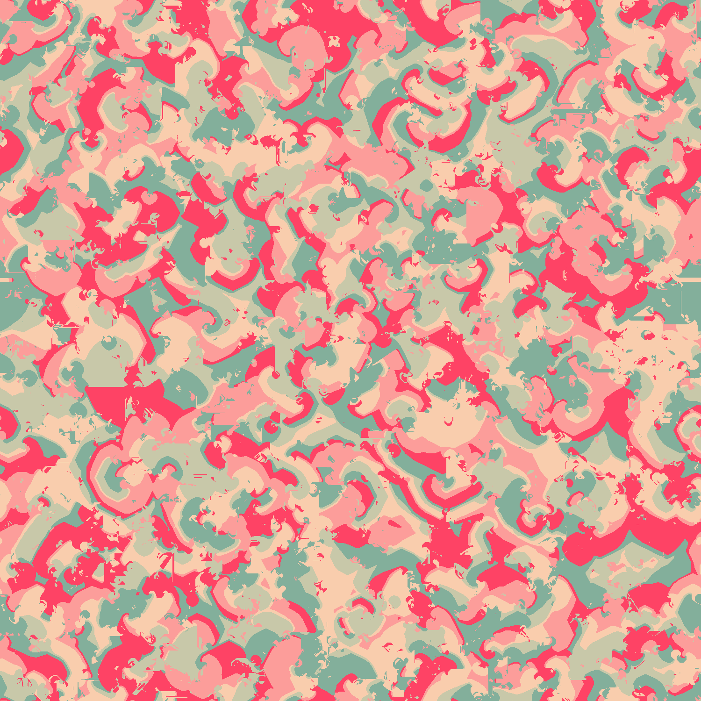

# Generative art using Cyclic Cellular Automata
### Requirements
- Node
### How to use it
Modify options in `src/index.js` like `HOOD`, `THRESHOLD`, `PALLETE`. You can find different available options in files `examples/../opts.json`.
```
$ npm install
$ npm start
```
# Gallery
| | |
|:-------------------------:|:-------------------------:|
|  Moore remote |  Corners |
|  Moore |  Blades |
